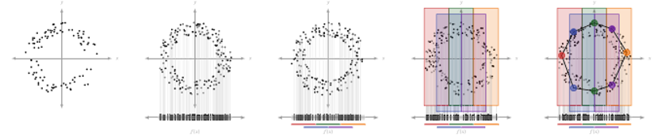
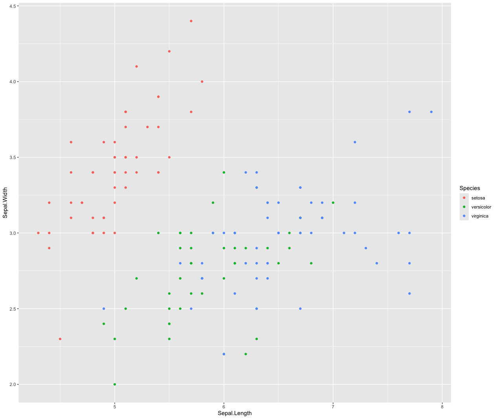
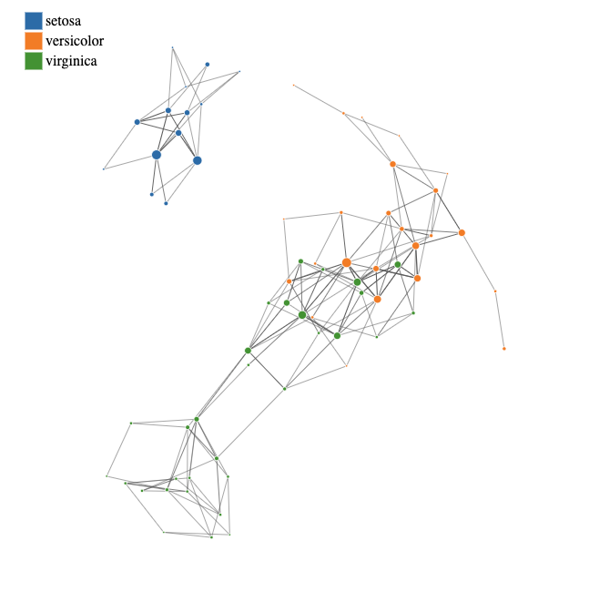

# Topological Data Analysis: Mapper Algorithm
<!-- badges: start -->
[](https://cran.r-project.org/package=MapperAlgo)
<a href="https://CRAN.R-project.org/package=MapperAlgo" target="_blank" rel="noreferrer">  </a> 
<!-- badges: end -->

## Document
For a more detailed explanation for this package, this [document](https://bookdown.org/kennywang2003/vignettes/) will keep update for better understanding the source code. 
I've written some articles on Medium, which you can find [here](https://medium.com/@kennywang2003) to get familiar with topological data analysis.

## Get started quickly


Step visualize from [Skaf et al.](https://doi.org/10.1016/j.jbi.2022.104082)

**Mapper is basically a three-step process:**

1\. **Cover**: This step splits the data into overlapping intervals and creates a cover for the data.

2\. **Cluster**: This step clusters the data points in each interval the cover creates.

3\. **Simplicial Complex**: This step combines the two steps above, which connects the data points in the cover to create a simplicial complex.

> you can know more about the basic here: Chazal, F., & Michel, B. (2021). An introduction to topological data analysis: fundamental and practical aspects for data scientists. Frontiers in artificial intelligence, 4, 667963.

### Example

``` r
data <- get(data("iris"))

Mapper <- MapperAlgo(
  data[,1:4],
  filter_values = data[,1:3],
  percent_overlap = 30,
  methods = "kmeans",
  method_params = list(max_kmeans_clusters = 2),
  cover_type = 'stride',
  interval_width = 1,
  num_cores = 12
  )

MapperPlotter(Mapper, label=data$Species, original_data=data, avg=FALSE, use_embedding=FALSE)
```

<table>
  <tr>
    <td><br/>Figure 1</td>
    <td><br/>Figure 2</td>
  </tr>
</table>


## Playground (Frontend Beta)

The frontend is still under testing but has been deployed to [tda frontend](https://tda-rfrontend.vercel.app/). By integrating webR, it executes the R-based MapperAlgo algorithm directly in the browser via the package.

To visualize your own data, upload a JSON file formatted as shown below. The `cc` is optional; you can ignore it unless you have pre-calculated labels. The iris example may take a moment to load, so feel free to upload your own file without waiting!
```R

library(jsonlite)

export_data <- list(
  adjacency = Mapper$adjacency,
  num_vertices = Mapper$num_vertices,
  level_of_vertex = Mapper$level_of_vertex,
  points_in_vertex = Mapper$points_in_vertex,
  original_data = as.data.frame(all_features),
  # This is the label that already calculated for each node
  cc = tibble(
    eigen_centrality = e_scores,
    betweenness = b_scores
  )
)
write(toJSON(export_data, auto_unbox = TRUE), "~/desktop/mnist.json")
```

