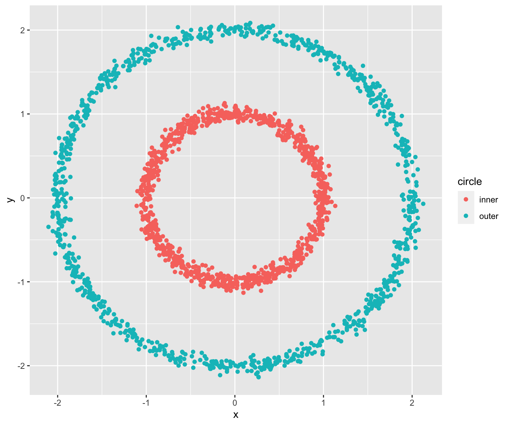
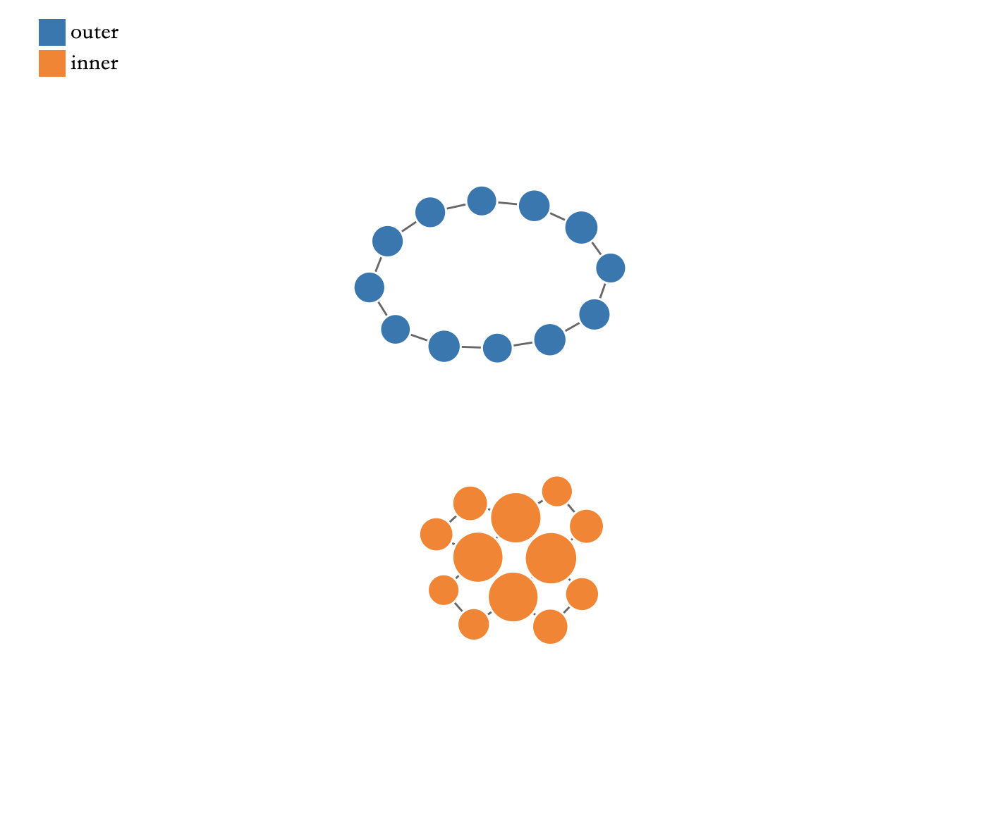
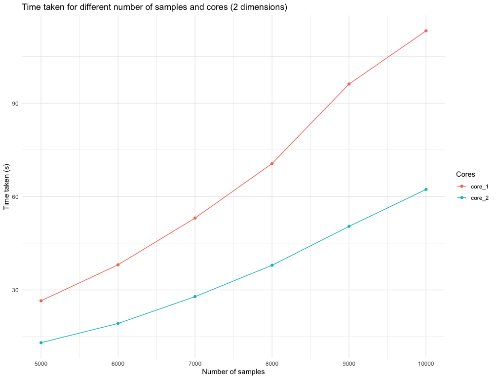
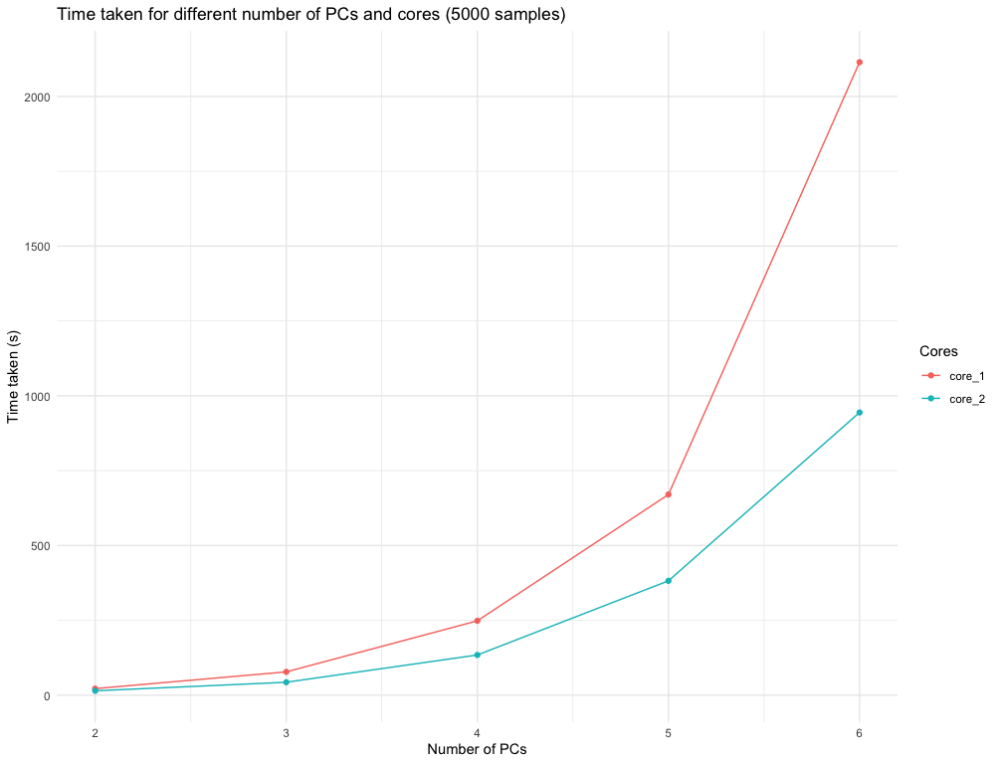

# Topological Data Analysis: Mapper Algorithm
Try this [playground](https://tf3q5u-0-0.shinyapps.io/mapperalgo/) to get familier with the algorithm !<br/>

This package is based on the `TDAmapper` package by Paul Pearson. You can view the original package [here](https://github.com/paultpearson/TDAmapper). Since the original package hasn't been updated in over seven years, this version is focused on optimization. By incorporating vector computation into the Mapper algorithm, this package aims to significantly improve its performance.

## Get started quickly

 Step visualize from [Skaf et al.](https://doi.org/10.1016/j.jbi.2022.104082)

**Mapper is basically a three-step process:**

1\. **Cover**: This step splits the data into overlapping intervals and creates a cover for the data.

2\. **Cluster**: This step clusters the data points in each interval the cover creates.

3\. **Simplicial Complex**: This step combines the two steps above, which connects the data points in the cover to create a simplicial complex.

> you can know more about the basic here: Chazal, F., & Michel, B. (2021). An introduction to topological data analysis: fundamental and practical aspects for data scientists. Frontiers in artificial intelligence, 4, 667963.

**Besides to the steps above, you can find the following code in the package:**

1.  Mapper.R: Combining the three steps above
2.  ConvertLevelset.R: Converting a Flat Index to a Multi-index, or vice versa.
3.  EdgeVertices.R This is to find the nodes for plot, not for the Mapper algorithm.

## Goals

Although this project serves as a personal training exercise, I have set several key objectives:

1.  **Optimization**: While the current version speeds up computations by 100 times as the dataset grows, there are still some computational challenges that need to be addressed.

2.  **Expanded Clustering Methods**: Clustering is a crucial component of the Mapper algorithm. In addition to hierarchical clustering, I aim to include a variety of clustering techniques to increase flexibility and adaptability. (ex. K-means, DBSCAN, etc.)

3.  **Code Structure**: The code is still under development and may be challenging to understand in its current form. My goal is to streamline the structure and provide a simple white paper that explains how to use the method effectively.

4.  **Interval Clustering Optimization**: Most of the packages haven't produced the best clustering results in each interval. However, if this could be incorporated while computing the Mapper, it would be powerful. This will be part of future work, although it might increase computational complexity.

5.  **Parallel**: Given the problem mentioned above, I plan to add parallel computation in the future. This will allow for flexible adjustment of the number of cores used for parallel computation, making the process more efficient.


### Example

``` r
Mapper <- MapperAlgo(
  filter_values = circle_data[,2:3],
  intervals = 4,
  percent_overlap = 50,
  methods = "dbscan", 
  # Params that performs in the choosed methods
  method_params = list(eps = 0.5, minPts = 5)
  )
```

<table>
  <tr>
    <td><br/>Figure 1</td>
    <td><br/>Figure 2</td>
  </tr>
</table>

### Computation Performance
Figures 3 and 4 illustrate the impact of parallel computing introduced in Version 1.0.2 using the MNIST dataset. <br/>
Figure 3 visualizes the time taken for different sample sizes when reducing the input to two dimensions using PCA, 
demonstrating how parallel computing accelerates computation.
Figure 4 keeps the sample size fixed while incrementally increasing the number of dimensions in each iteration. 
It clearly shows that the number of features used in filter functions significantly affects computing time.<br/>
You can find the code in Performance.R
<table>
  <tr>
    <td><br/>Figure 3</td>
    <td><br/>Figure 4</td>
  </tr>
</table>

### Update Feature

Version 1.0.1: <br/>1. Update more readable structure <br/>2. Added Kmeans, DBscan, and PAM clustering methods for user <br/>
Version 1.0.2: <br/>1. Parallel computing <br/>2. Fix unused parameter (num_bins_when_clustering) <br/>3. Frontend published using [shiny](https://shiny.posit.co/)

## Stay Updated

I've written some articles on Medium, which you can find [here](https://medium.com/@kennywang2003) to get familiar with topological data analysis. I'll be continuously updating my work, and I welcome any feedback!

### Build And Submit:

This is for the author to submit the package to CRAN.

``` r
# outo update RoxygenNote
devtools::document()
devtools::check()
# pack to .tar.gz
devtools::build()
devtools::submit_cran()
```
