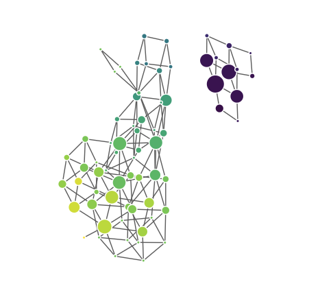

# Topological Data Analysis: Mapper Algorithm
<!-- badges: start -->
[](https://cran.r-project.org/package=MapperAlgo)
<a href="https://CRAN.R-project.org/package=MapperAlgo" target="_blank" rel="noreferrer">  </a> 
<!-- badges: end -->

## Playground & Document
For a more detailed explanation for this package, this [document](https://bookdown.org/kennywang2003/vignettes/) will keep update for better understanding the source code. You can also try the [playground](https://tf3q5u-0-0.shinyapps.io/mapperalgo/) I build to get familier with the algorithm<br/>
I've written some articles on Medium, which you can find [here](https://medium.com/@kennywang2003) to get familiar with topological data analysis. I'll be continuously updating my work, and I welcome any feedback!

> This package is based on the `TDAmapper` package by Paul Pearson. You can view the original package [here](https://github.com/paultpearson/TDAmapper). Since the original package hasn't been updated in over seven years, this version is focused on optimization. By incorporating vector computation into the Mapper algorithm, this package aims to significantly improve its performance.

## Get started quickly

 Step visualize from [Skaf et al.](https://doi.org/10.1016/j.jbi.2022.104082)

**Mapper is basically a three-step process:**

1\. **Cover**: This step splits the data into overlapping intervals and creates a cover for the data.

2\. **Cluster**: This step clusters the data points in each interval the cover creates.

3\. **Simplicial Complex**: This step combines the two steps above, which connects the data points in the cover to create a simplicial complex.

> you can know more about the basic here: Chazal, F., & Michel, B. (2021). An introduction to topological data analysis: fundamental and practical aspects for data scientists. Frontiers in artificial intelligence, 4, 667963.

**Besides to the steps above, you can find the following code in the package:**

1.  Mapper.R: Combining the three steps above
2.  ConvertLevelset.R: Converting a Flat Index to a Multi-index, or vice versa.
3.  EdgeVertices.R This is to find the nodes for plot, not for the Mapper algorithm.

### Example

``` r
data("iris")
data <- iris

Mapper <- MapperAlgo(
  filter_values = data[,1:4],
  percent_overlap = 30,
  methods = "dbscan",
  method_params = list(eps = 1, minPts = 1),
  # methods = "hierarchical",
  # method_params = list(num_bins_when_clustering = 10, method = 'ward.D2'),
  # methods = "kmeans",
  # method_params = list(max_kmeans_clusters = 2),
  # methods = "pam",
  # method_params = list(num_clusters = 2),
  cover_type = 'stride',
  # intervals = 4,
  interval_width = 1,
  num_cores = 12
  )

data$PW_group <- ifelse(data$Sepal.Width > 1.5, "wide", "narrow")
embedded <- CPEmbedding(Mapper, data, columns = list("PW_group", "Species"), a_level = "wide", b_level = "versicolor")
MapperPlotter(Mapper, label=embedded, data=data, type="forceNetwork", avg=TRUE, use_embedding=TRUE)
```

<table>
  <tr>
    <td><br/>Figure 1</td>
    <td><br/>Figure 2</td>
  </tr>
</table>
